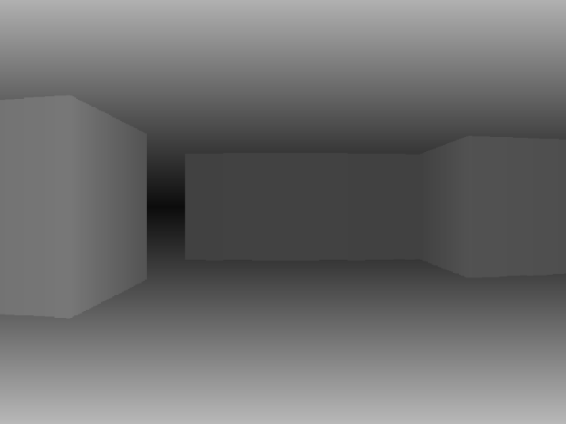

# raycast-swing
A raycasting engine using pure Java.

This is a minimalist raycasting engine that uses no external libraries. It's made from awt/swing using the `Graphics2D` api.

## Install

With Maven 
`mvn install pom.xml`

## Usage

- `a` and `d` to add and subtract the view angle.
- `w` and `s` to move forwards and backwards.
- `m` to toggle 2D view.
- `space` to auto-rotate.
- `p` to autoplay a full 360-loop.

## Personal Note

This project is special to me for some personal reasons.

I've had a rough history with math. There was never a time in class where I remember being 100% confident in what I was supposed to be doing. This was the reason I dropped out of high school, actually. During my first applied math course it was easy enough but of course I wanted to step it up and decided to take a 9th grade academic summer course for math. 

Failed it.

Moved on to the 10th grade and decided that I'm going to take its academic level and push myself. Not only did I fail again, but was embarrassed for not being able to answer the fundamentally basic questions. My "mathxiety" was set in stone.

Dropped out swiftly and felt miserable. Programming to me was so much fun! However.. any difficult math that was involved would leave me abandoning projects. It was a powerful sign of [Imposter Syndrome](https://en.wikipedia.org/wiki/Impostor_syndrome "Imposter Syndrome").

Then years later I force myself to learn. Was 20 and ready to take on the worst of it no matter how difficult it was. Completed my 12th grade math (skipped the two previous courses, turns out they're useless, and I'm lucky that they let me do it). It was difficult, but because it was an independent course with no pressure, it became more of something fun to do than something to dread. Made the call to my college and was accepted.

Despite completing that course, still felt like I didn't understand a lot of it. The one concept that I never understood but wanted to was triginomotry; specifically how sin/cos work. One night while browsing youtube, found this [video](https://www.youtube.com/watch?v=593w799sBms "video") which made everything click for me.

So here's the result of learning as much as possible and applying it.
